<div align="center">

# Systematic Physics Literature Review

**Auditable HEP and gravity literature reviews for Codex**

[](https://learn.chatgpt.com/docs/build-skills)
[](.codex/skills/survey-physics-literature/scripts)
[](#report-languages)
[](#data-sources)
[](https://github.com/Enjoy20030921/survey-physics-literature/commits/main)
[](LICENSE)

[English](README.md) · [简体中文](README.zh-CN.md)

[Why this Skill?](#why-this-skill) · [Quick start](#quick-start) · [Workflow](#workflow) · [Outputs](#outputs) · [CLI](#maintainer-cli) · [FAQ](#faq) · [License](#license)

</div>

Turn a physics question into a reproducible search, screened corpus, locator-backed evidence matrix, and publication-ready report. The Skill is designed for high-energy physics and gravitational physics, especially `hep-*` and `gr-qc` research.

> [!NOTE]
> The methodology is PRISMA-inspired and audit-oriented. It does **not** claim formal PRISMA 2020 compliance.

## Why this Skill?

| Review problem | What the Skill does |
| --- | --- |
| One paper may have arXiv, DOI, INSPIRE, and journal identities | Deduplicates by normalized DOI, version-independent arXiv ID, and INSPIRE recid before similarity matching |
| Abstracts are often overinterpreted | Uses abstracts for screening only; substantive claims require a full-text locator |
| Bilingual reports can drift scientifically | Uses one shared evidence base while writing two independent, evidence-equivalent reports |
| Updates can break citations and screening histories | Preserves stable record IDs, evidence IDs, screening decisions, and BibTeX keys |
| Fixed chapter templates distort different research questions | Derives the report hierarchy from the question, evidence topology, audience, and report scale |

### At a glance

| | |
| --- | --- |
| **Review modes** | New systematic review · seed-paper expansion · incremental update |
| **Primary scope** | HEP and gravity, including `hep-th`, `hep-ph`, `hep-ex`, `hep-lat`, and `gr-qc` |
| **Report languages** | Chinese · English · separate bilingual reports |
| **Data operations** | Deterministic Python standard-library scripts |
| **Report toolchain** | XeLaTeX + BibTeX, with explicit diagnostics when unavailable |
| **Access policy** | Lawful full text only; never bypass access controls |

## Quick start

### 1. Install the Skill

This repository preserves the authored Skill at:

```text
.codex/skills/survey-physics-literature/
```

Current [OpenAI Build skills documentation](https://learn.chatgpt.com/docs/build-skills) lists `.agents/skills/` as the local discovery location for standalone Codex Skills. Copy the directory into your project:

```text
<your-project>/.agents/skills/survey-physics-literature/
```

<details>
<summary><strong>macOS / Linux</strong></summary>

```bash
git clone --depth 1 https://github.com/Enjoy20030921/survey-physics-literature.git
mkdir -p /path/to/your-project/.agents/skills
cp -R survey-physics-literature/.codex/skills/survey-physics-literature \
  /path/to/your-project/.agents/skills/
```

</details>

<details>
<summary><strong>Windows PowerShell</strong></summary>

```powershell
git clone --depth 1 https://github.com/Enjoy20030921/survey-physics-literature.git
New-Item -ItemType Directory -Force C:\path\to\your-project\.agents\skills
Copy-Item -Recurse survey-physics-literature\.codex\skills\survey-physics-literature `
  C:\path\to\your-project\.agents\skills\survey-physics-literature
```

</details>

Codex detects Skill changes automatically in supported discovery locations. Restart Codex if the Skill does not appear.

### 2. Invoke it

Use an explicit mention:

```text
$survey-physics-literature
```

Or ask naturally in Chinese or English. The bilingual description in [`SKILL.md`](.codex/skills/survey-physics-literature/SKILL.md) supports implicit invocation.

### 3. Supply a review protocol

```text
Use $survey-physics-literature to review the island formula in the black-hole information problem.

Research question: What evidence, assumptions, and major disputes surround the island formula and the Page curve in semiclassical gravity?
arXiv categories: hep-th, gr-qc
Date range: all-time
Include: original papers, reviews, lectures, and relevant proceedings
Exclude: papers that mention islands only in the abstract without substantive full-text treatment
Report language: English
```

<details>
<summary><strong>Chinese prompt example</strong></summary>

```text
请使用 $survey-physics-literature 调研黑洞信息问题中的岛公式。

研究问题：岛公式在半经典引力中解决 Page curve 问题的证据、假设和主要争议是什么？
arXiv 分类：hep-th, gr-qc
时间范围：all-time
纳入：原创论文、综述、讲义和相关会议论文
排除：只在摘要中提及 island、但正文没有实质讨论的文献
报告语言：中文
```

</details>

## When to use it

| Use the Skill for | Do not use it for |
| --- | --- |
| Systematic or scoped physics literature reviews | An isolated physics calculation |
| Research-landscape and progress surveys | A one-paper summary with no expansion request |
| Finding related HEP or `gr-qc` papers | Unsupported claims based only on snippets or abstracts |
| Citation expansion from seed papers | Bypassing paywalls or authentication |
| Updating an existing review directory | Mechanically translating one report into another |
| Comparing agreements, contradictions, assumptions, and gaps | Claiming formal PRISMA compliance |

## Review settings

### Required

| Setting | Purpose |
| --- | --- |
| Research question | Defines the physics problem the synthesis must answer |
| arXiv categories | Constrains the disciplinary search space |
| Date range or `all-time` | Makes temporal coverage explicit |
| Inclusion criteria | Defines eligible document types, systems, methods, and scope |
| Exclusion criteria | Makes rejection decisions reproducible |

### Optional

| Setting | Purpose |
| --- | --- |
| Seed-paper identifiers | Expands from arXiv IDs, DOIs, or INSPIRE recids |
| User search terms | Adds concepts, observables, names, and alternate terminology |
| Existing review directory | Enables stable incremental updates |
| `report_language` | Chooses `zh`, `en`, or `bilingual` |

### Report languages

| Normalized value | Accepted examples | Output |
| --- | --- | --- |
| `zh` | `中文`, `Chinese`, `zh` | Chinese report only |
| `en` | `英文`, `English`, `en` | English report only |
| `bilingual` | `中英双语`, `bilingual` | Two complete, separate reports |

If the language is unspecified, the Skill asks once. If no answer is available, it falls back to `bilingual`. The normalized choice is stored in `protocol.json` and retained during updates unless explicitly overridden.

## Workflow

```mermaid
flowchart LR
    subgraph P["1 · Plan"]
        direction TB
        A["Intent + settings"] --> B["Frozen protocol"]
    end
    subgraph D["2 · Discover"]
        direction TB
        C["Concepts + queries"] --> D1["arXiv + INSPIRE"] --> E["Crossref + dedupe"]
    end
    subgraph V["3 · Evaluate"]
        direction TB
        F["Title + abstract screen"] --> G["Full text + citations"] --> H["Locator-backed evidence"]
    end
    subgraph R["4 · Deliver"]
        direction TB
        I["Adaptive synthesis"] --> J["Audit + TeX/PDF"]
    end

    B --> C
    E --> F
    H --> I

    classDef protocol fill:#e0f2fe,stroke:#0369a1,color:#0c4a6e;
    classDef sources fill:#fef3c7,stroke:#b45309,color:#78350f;
    classDef evidence fill:#dcfce7,stroke:#15803d,color:#14532d;
    classDef output fill:#ede9fe,stroke:#7c3aed,color:#4c1d95;
    class A,B protocol;
    class C,D1,E sources;
    class F,G,H evidence;
    class I,J output;
```



### Evidence contract

Every material synthesis statement follows a traceable chain:

```text
report claim -> evidence ID -> record ID -> full-text locator -> citation
```

Acceptable locators include a section, page, equation, figure, or table. Search snippets, metadata pages, and abstracts are not treated as full-text evidence.

## Outputs

Each review lives under `literature-reviews/<topic-slug>/`.

| Layer | Files |
| --- | --- |
| Protocol | `protocol.json` |
| Corpus | `records.jsonl`, `screening.csv` |
| Evidence | `evidence.csv`, `references.bib` |
| Provenance | `search_runs.jsonl`, `fulltext/manifest.jsonl` |
| Update history | `update_summary.md`, archived obsolete outputs under `runs/` |
| Optional report components | generated search summaries, selection flows, and included-study tables |

Language-dependent files are exact:

| Mode | TeX/PDF outputs |
| --- | --- |
| `zh` | `report_zh.tex`, `report_zh.pdf` |
| `en` | `report_en.tex`, `report_en.pdf` |
| `bilingual` | Both complete TeX/PDF pairs |

Changing the language mode archives obsolete report variants so stale files cannot be mistaken for current output.

## Adaptive report architecture

There is no universal chapter list. The Skill may organize a review conceptually, methodologically, chronologically, comparatively, around controversies, or with another structure justified by the evidence.

Scope, search provenance, evidence-backed synthesis, disagreement, uncertainty, limitations, citations, and auditability remain **content obligations**, not required headings. Generated audit fragments are optional building blocks rather than mandatory appendices.

## Data sources

| Source | Role |
| --- | --- |
| [arXiv API](https://info.arxiv.org/help/api/user-manual.html) | Primary preprint discovery and metadata |
| [INSPIRE REST API](https://github.com/inspirehep/rest-api-doc) | Primary HEP metadata, records, and citation relationships |
| [Crossref REST API](https://support.crossref.org/hc/en-us/articles/214320426-REST-API) | DOI and journal-publication enrichment |

The retrieval layer uses caching, request spacing, retry handling, and source-level provenance. It downloads only lawfully accessible full text and never bypasses login, paywalls, or access controls.

## Maintainer CLI

The deterministic scripts maintain reproducible data operations. They do not make scientific inclusion decisions or write the final synthesis.

<details>
<summary><strong>Initialize and retrieve a review</strong></summary>

```bash
python .codex/skills/survey-physics-literature/scripts/literature_pipeline.py init \
  literature-reviews/island-formula \
  --question "What evidence and assumptions support the island formula?" \
  --categories hep-th gr-qc \
  --date-range all-time \
  --include "Original papers, reviews, lectures, and proceedings" \
  --exclude "Abstract-only mentions without substantive treatment" \
  --language en
```

Freeze the exact arXiv and INSPIRE queries in `protocol.json`, then run:

```bash
python .codex/skills/survey-physics-literature/scripts/literature_pipeline.py search literature-reviews/island-formula
python .codex/skills/survey-physics-literature/scripts/literature_pipeline.py download literature-reviews/island-formula
python .codex/skills/survey-physics-literature/scripts/literature_pipeline.py render-audit literature-reviews/island-formula
```

</details>

<details>
<summary><strong>Audit and compile reports</strong></summary>

```bash
python .codex/skills/survey-physics-literature/scripts/audit_review.py literature-reviews/island-formula --require-reports
python .codex/skills/survey-physics-literature/scripts/compile_reports.py literature-reviews/island-formula
python .codex/skills/survey-physics-literature/scripts/audit_review.py literature-reviews/island-formula --require-reports --require-pdfs
```

Compilation uses XeLaTeX -> BibTeX -> XeLaTeX x2. If XeLaTeX or BibTeX is unavailable, valid sources remain in place and the script returns an explicit diagnostic; it never installs a TeX distribution automatically.

</details>

<details>
<summary><strong>Run validation</strong></summary>

```bash
python -B .codex/skills/survey-physics-literature/scripts/test_skill_scripts.py
```

The offline suite covers language normalization, bilingual triggers, arXiv and INSPIRE parsing, old arXiv identifiers, collaboration authors, Unicode, deduplication, caching, HTTP 429 retries, conditional report outputs, and audit failures.

The Skill also passes the official `quick_validate.py` checker and representative Chinese and English XeLaTeX/BibTeX builds.

</details>

<details>
<summary><strong>Repository layout</strong></summary>

```text
.codex/skills/survey-physics-literature/
├── SKILL.md
├── agents/
│   └── openai.yaml
├── assets/
│   ├── report_en.tex
│   ├── report_zh.tex
│   └── review-macros.tex
├── references/
│   ├── data-contracts.md
│   ├── methodology.md
│   ├── reporting.md
│   └── source-guides.md
└── scripts/
    ├── audit_review.py
    ├── compile_reports.py
    ├── literature_pipeline.py
    └── test_skill_scripts.py
```

</details>

## FAQ

<details>
<summary><strong>Does the Skill require a fixed report outline?</strong></summary>

No. It selects a structure that fits the question and evidence. Methodological and audit information must remain available, but it does not need to appear under prescribed chapter names.

</details>

<details>
<summary><strong>Can abstracts support scientific claims?</strong></summary>

No. Abstracts are used for screening. Substantive claims require a locator in lawfully accessed full text.

</details>

<details>
<summary><strong>Are bilingual reports translations of one another?</strong></summary>

No. They share bibliography keys, evidence IDs, scientific coverage, and screening totals, but each report is written naturally and independently.

</details>

<details>
<summary><strong>Is a TeX installation mandatory?</strong></summary>

Only for PDF compilation. The data workflow and valid `.tex` sources remain usable without XeLaTeX or BibTeX.

</details>

<details>
<summary><strong>Can the Skill retrieve paywalled papers?</strong></summary>

It records inaccessible full text but never bypasses access controls. A user may provide a lawfully obtained local copy for evidence extraction.

</details>

## Scientific and operational limits

- No search can guarantee discovery of every relevant paper.
- Metadata services may be incomplete, delayed, rate-limited, or temporarily unavailable.
- Automated normalization and deduplication remain reviewable, not infallible.
- Citation expansion can introduce field or author-network bias and must be documented.
- Final synthesis still requires physics judgment; deterministic scripts support that judgment but do not replace it.

## License

Released under the [MIT License](LICENSE). You may use, modify, and distribute the project subject to the license terms. See the [changelog](CHANGELOG.md) for version history.

---

<div align="center">

Built around traceable evidence, lawful access, and adaptable scientific writing.

</div>
