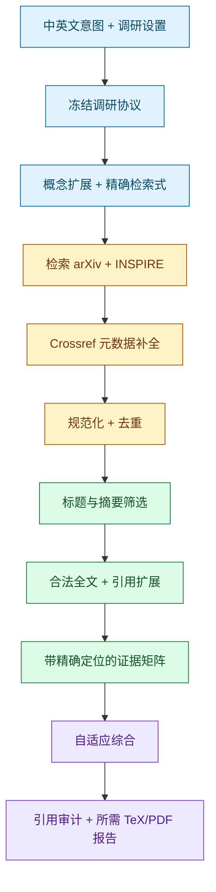

<div align="center">

# 系统性物理文献调研

**面向 Codex 的可审计高能物理与引力文献调研 Skill**

[](https://learn.chatgpt.com/docs/build-skills)
[](.codex/skills/survey-physics-literature/scripts)
[](#报告语言)
[](#数据源)
[](https://github.com/Enjoy20030921/survey-physics-literature/commits/main)

[English](README.md) · [简体中文](README.zh-CN.md)

[为什么使用它？](#为什么使用它) · [快速开始](#快速开始) · [工作流](#工作流) · [输出](#输出) · [命令行](#维护者命令行) · [常见问题](#常见问题)

</div>

把一个物理问题转化为可复现检索、经过筛选的文献集、带全文定位的证据矩阵，以及可直接编译的调研报告。Skill 重点服务于高能物理和引力物理，尤其是 `hep-*` 与 `gr-qc` 方向。

> [!NOTE]
> 本方法受 PRISMA 思路启发并强调可审计性，但**不宣称**正式符合 PRISMA 2020。

## 为什么使用它？

| 文献调研中的问题 | Skill 的处理方式 |
| --- | --- |
| 同一论文可能同时具有 arXiv、DOI、INSPIRE 和期刊身份 | 优先按规范化 DOI、去版本 arXiv ID 和 INSPIRE recid 去重，再进行相似度匹配 |
| 摘要容易被过度解读 | 摘要只用于筛选；实质性结论必须具有全文定位信息 |
| 中英文报告容易出现科学内容漂移 | 共享同一证据库，同时独立撰写两份证据等价的完整报告 |
| 更新综述可能破坏引用和筛选历史 | 保留稳定的记录 ID、证据 ID、筛选决定和 BibTeX 键 |
| 固定章节模板无法适应不同研究问题 | 根据研究问题、证据结构、目标读者和报告规模设计正文层级 |

### 一览

| | |
| --- | --- |
| **调研模式** | 新建系统性调研 · 从种子论文扩展 · 增量更新 |
| **主要范围** | HEP 与引力，包括 `hep-th`、`hep-ph`、`hep-ex`、`hep-lat` 和 `gr-qc` |
| **报告语言** | 中文 · 英文 · 两份独立双语报告 |
| **数据处理** | 仅依赖 Python 标准库的确定性脚本 |
| **报告工具链** | XeLaTeX + BibTeX；缺失时返回明确诊断 |
| **访问原则** | 只获取合法可访问全文，绝不绕过访问控制 |

## 快速开始

### 1. 安装 Skill

本仓库保留的 Skill 源目录为：

```text
.codex/skills/survey-physics-literature/
```

OpenAI 当前的 [Build skills 文档](https://learn.chatgpt.com/docs/build-skills)将 `.agents/skills/` 列为独立 Codex Skill 的本地发现目录。请把 Skill 复制到目标项目：

```text
<目标项目>/.agents/skills/survey-physics-literature/
```

<details>
<summary><strong>macOS / Linux</strong></summary>

```bash
git clone --depth 1 https://github.com/Enjoy20030921/survey-physics-literature.git
mkdir -p /path/to/your-project/.agents/skills
cp -R survey-physics-literature/.codex/skills/survey-physics-literature \
  /path/to/your-project/.agents/skills/
```

</details>

<details>
<summary><strong>Windows PowerShell</strong></summary>

```powershell
git clone --depth 1 https://github.com/Enjoy20030921/survey-physics-literature.git
New-Item -ItemType Directory -Force C:\path\to\your-project\.agents\skills
Copy-Item -Recurse survey-physics-literature\.codex\skills\survey-physics-literature `
  C:\path\to\your-project\.agents\skills\survey-physics-literature
```

</details>

Codex 会自动检测受支持目录中的 Skill 变更。如果没有出现，请重启 Codex。

### 2. 调用 Skill

显式调用：

```text
$survey-physics-literature
```

也可以直接使用自然中文或英文提出任务。[`SKILL.md`](.codex/skills/survey-physics-literature/SKILL.md) 中的双语描述支持隐式触发。

### 3. 提供调研协议

```text
请使用 $survey-physics-literature 调研黑洞信息问题中的岛公式。

研究问题：岛公式在半经典引力中解决 Page curve 问题的证据、假设和主要争议是什么？
arXiv 分类：hep-th, gr-qc
时间范围：all-time
纳入：原创论文、综述、讲义和相关会议论文
排除：只在摘要中提及 island、但正文没有实质讨论的文献
报告语言：中文
```

<details>
<summary><strong>英文提示词示例</strong></summary>

```text
Use $survey-physics-literature to review the island formula in the black-hole information problem.

Research question: What evidence, assumptions, and major disputes surround the island formula and the Page curve in semiclassical gravity?
arXiv categories: hep-th, gr-qc
Date range: all-time
Include: original papers, reviews, lectures, and relevant proceedings
Exclude: papers that mention islands only in the abstract without substantive full-text treatment
Report language: English
```

</details>

## 适用与不适用场景

| 适合使用 | 不适合使用 |
| --- | --- |
| 系统性或有明确范围的物理文献调研 | 单独的物理计算 |
| 研究版图、研究进展与发展脉络梳理 | 没有扩展要求的单篇论文总结 |
| 查找 HEP 或 `gr-qc` 相关论文 | 仅依据检索片段或摘要提出科学结论 |
| 从种子论文扩展引用网络 | 绕过付费墙、登录或其他访问控制 |
| 更新已有综述目录 | 把一份报告机械翻译成另一种语言 |
| 比较共识、矛盾、假设与研究空白 | 宣称正式符合 PRISMA |

## 调研设置

### 必填项

| 设置 | 作用 |
| --- | --- |
| 研究问题 | 定义综合最终必须回答的物理问题 |
| arXiv 分类 | 限定学科检索空间 |
| 时间范围或 `all-time` | 明确时间覆盖范围 |
| 纳入标准 | 定义可纳入的文献类型、物理体系、方法与范围 |
| 排除标准 | 使拒绝文献的决定可以复核 |

### 可选项

| 设置 | 作用 |
| --- | --- |
| 种子论文标识符 | 从 arXiv ID、DOI 或 INSPIRE recid 扩展 |
| 用户检索词 | 补充概念、观测量、人物与替代术语 |
| 已有综述目录 | 启用保留稳定标识符的增量更新 |
| `report_language` | 选择 `zh`、`en` 或 `bilingual` |

### 报告语言

| 规范值 | 可接受写法 | 输出 |
| --- | --- | --- |
| `zh` | `中文`、`Chinese`、`zh` | 仅中文报告 |
| `en` | `英文`、`English`、`en` | 仅英文报告 |
| `bilingual` | `中英双语`、`bilingual` | 两份完整、独立的报告 |

未指定语言时，Skill 会询问一次；如果无法获得回答，则回退为 `bilingual`。规范化后的选择记录在 `protocol.json` 中，并在增量更新时保留，除非用户明确覆盖。

## 工作流



### 证据契约

每一条实质性综合结论都遵循可追踪链条：

```text
报告结论 -> 证据 ID -> 记录 ID -> 全文定位 -> 文献引用
```

可接受的定位包括章节、页码、公式、图或表。检索片段、元数据页面和摘要不能作为全文证据。

## 输出

每次调研保存在 `literature-reviews/<topic-slug>/`。

| 层级 | 文件 |
| --- | --- |
| 调研协议 | `protocol.json` |
| 文献集 | `records.jsonl`、`screening.csv` |
| 证据 | `evidence.csv`、`references.bib` |
| 来源追踪 | `search_runs.jsonl`、`fulltext/manifest.jsonl` |
| 更新历史 | `update_summary.md`、`runs/` 下归档的过时输出 |
| 可选报告组件 | 检索摘要、筛选流程、纳入文献表 |

语言相关输出严格对应所选模式：

| 模式 | TeX/PDF 输出 |
| --- | --- |
| `zh` | `report_zh.tex`、`report_zh.pdf` |
| `en` | `report_en.tex`、`report_en.pdf` |
| `bilingual` | 两套完整的 TeX/PDF 报告 |

切换语言模式时，过时报告会被归档，避免把旧文件误认为当前结果。

## 自适应报告结构

Skill 不规定统一章节列表。它可以根据证据采用概念型、方法型、时间型、比较型、争议导向型或其他更合适的组织方式。

调研范围、检索来源、证据综合、分歧、不确定性、局限、引用和可审计性仍是**必须覆盖的信息**，但不是必须使用的标题。自动生成的审计片段是可选组件，不是强制附录。

## 数据源

| 来源 | 作用 |
| --- | --- |
| [arXiv API](https://info.arxiv.org/help/api/user-manual.html) | 主要预印本发现与元数据来源 |
| [INSPIRE REST API](https://github.com/inspirehep/rest-api-doc) | 主要 HEP 元数据、记录与引用关系来源 |
| [Crossref REST API](https://support.crossref.org/hc/en-us/articles/214320426-REST-API) | DOI 与期刊出版信息补全 |

检索层实现缓存、请求间隔、重试和来源级溯源。系统只下载合法可访问的全文，绝不绕过登录、付费墙或其他访问控制。

## 维护者命令行

确定性脚本负责维护可复现的数据操作，不自行决定科学文献的纳入与排除，也不代替研究者撰写最终综合。

<details>
<summary><strong>初始化并检索调研</strong></summary>

```bash
python .codex/skills/survey-physics-literature/scripts/literature_pipeline.py init \
  literature-reviews/island-formula \
  --question "岛公式成立的主要证据和关键假设是什么？" \
  --categories hep-th gr-qc \
  --date-range all-time \
  --include "原创论文、综述、讲义和会议论文" \
  --exclude "只在摘要提及、正文无实质讨论的文献" \
  --language zh
```

在 `protocol.json` 中冻结精确的 arXiv 与 INSPIRE 检索式，然后运行：

```bash
python .codex/skills/survey-physics-literature/scripts/literature_pipeline.py search literature-reviews/island-formula
python .codex/skills/survey-physics-literature/scripts/literature_pipeline.py download literature-reviews/island-formula
python .codex/skills/survey-physics-literature/scripts/literature_pipeline.py render-audit literature-reviews/island-formula
```

</details>

<details>
<summary><strong>审计并编译报告</strong></summary>

```bash
python .codex/skills/survey-physics-literature/scripts/audit_review.py literature-reviews/island-formula --require-reports
python .codex/skills/survey-physics-literature/scripts/compile_reports.py literature-reviews/island-formula
python .codex/skills/survey-physics-literature/scripts/audit_review.py literature-reviews/island-formula --require-reports --require-pdfs
```

编译顺序为 XeLaTeX -> BibTeX -> XeLaTeX x2。如果缺少 XeLaTeX 或 BibTeX，脚本会保留有效源文件并返回明确诊断，不会自动安装 TeX 发行版。

</details>

<details>
<summary><strong>运行验证</strong></summary>

```bash
python -B .codex/skills/survey-physics-literature/scripts/test_skill_scripts.py
```

离线测试覆盖语言规范化、中英文触发、arXiv 与 INSPIRE 解析、旧式 arXiv ID、合作组作者、Unicode、去重、缓存、HTTP 429 重试、条件化报告输出和审计失败。

本 Skill 还通过了官方 `quick_validate.py` 校验，以及代表性中英文报告的 XeLaTeX/BibTeX 编译测试。

</details>

<details>
<summary><strong>仓库结构</strong></summary>

```text
.codex/skills/survey-physics-literature/
├── SKILL.md
├── agents/
│   └── openai.yaml
├── assets/
│   ├── report_en.tex
│   ├── report_zh.tex
│   └── review-macros.tex
├── references/
│   ├── data-contracts.md
│   ├── methodology.md
│   ├── reporting.md
│   └── source-guides.md
└── scripts/
    ├── audit_review.py
    ├── compile_reports.py
    ├── literature_pipeline.py
    └── test_skill_scripts.py
```

</details>

## 常见问题

<details>
<summary><strong>报告必须使用固定章节吗？</strong></summary>

不需要。Skill 会选择适合研究问题和证据的结构。方法与审计信息必须保留，但无需放在预设章节名称下。

</details>

<details>
<summary><strong>摘要可以支持科学结论吗？</strong></summary>

不可以。摘要用于筛选；实质性结论必须具有合法获取全文中的精确定位。

</details>

<details>
<summary><strong>双语报告是逐句翻译吗？</strong></summary>

不是。两份报告共享 BibTeX 键、证据 ID、科学覆盖范围和筛选总数，但会按照各自语言自然、独立地撰写。

</details>

<details>
<summary><strong>必须安装 TeX 吗？</strong></summary>

只有编译 PDF 时需要。没有 XeLaTeX 或 BibTeX 时，数据工作流和有效 `.tex` 源文件仍可使用。

</details>

<details>
<summary><strong>可以获取付费论文吗？</strong></summary>

Skill 会记录无法访问的全文，但不会绕过访问控制。用户可以提供自己合法获得的本地副本用于证据提取。

</details>

## 科学与运行边界

- 任何检索都无法保证发现全部相关论文。
- 元数据服务可能存在缺失、延迟、限流或暂时不可用。
- 自动规范化和去重可以复核，但并非绝对无误。
- 引用扩展可能带来领域偏差或作者网络偏差，必须如实记录。
- 最终综合仍需要物理学领域判断；确定性脚本支持判断，但不能替代判断。

---

<div align="center">

以可追踪证据、合法访问和自适应科学写作为核心。

</div>
